## :sparkles: CSS Selectors

| Preview                           | Selector                                                     | Description                                                  |
| --------------------------------- | ------------------------------------------------------------ | ------------------------------------------------------------ |
| [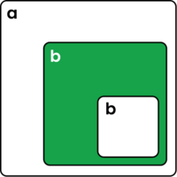](https://developer.mozilla.org/en-US/docs/Web/CSS/Child_combinator) | 
<strong>a > b</strong> <a href="https://developer.mozilla.org/en-US/docs/Web/CSS/Child_combinator">Child Combinator</a>
 | Select all b elements that are directly inside of a elements. |
|  | 
<strong>a &nbsp; b</strong> <a href="https://developer.mozilla.org/en-US/docs/Web/CSS/Descendant_combinator">Descendant Combinator</a>
 | Select all b elements that are anywhere inside of a elements. |
|  | 
<strong>a + b</strong> <a href="https://developer.mozilla.org/en-US/docs/Web/CSS/Adjacent_sibling_combinator">Adjacent sibling combinator</a>
 | Select all b elements that are immediately next to a elements. |
|  | 
<strong>a ~ b</strong> <a href="https://developer.mozilla.org/en-US/docs/Web/CSS/General_sibling_combinator">General sibling combinator</a>
 | Select all b elements that are anywhere after a elements. |
|  | 
<strong>.cl</strong> <a href="https://developer.mozilla.org/en-US/docs/Web/CSS/Class_selectors">Class selector</a>
 | Select all elements that have the cl class name. |
|  | 
<strong>a.cl</strong> <a href="https://developer.mozilla.org/en-US/docs/Web/CSS/Type_selectors">Tag + Class selector</a>
 | Select all a elements that have the cl class name. |
|  | 
<strong>.cl1.cl2</strong> <a href="https://developer.mozilla.org/en-US/docs/Web/CSS/Class_selectors">Multiclass selector</a>
 | Select all elements that have both the cl1 and cl2 class names. |
| [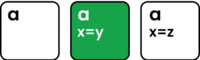](https://developer.mozilla.org/en-US/docs/Web/CSS/Attribute_selectors) | 
<strong>a\[x=y\]</strong> <a href="https://developer.mozilla.org/en-US/docs/Web/CSS/Attribute_selectors">Attribute selector</a>
 | Select all a elements that have the x attribute set to y. |
|  | 
<strong>#id1</strong> <a href="https://developer.mozilla.org/en-US/docs/Web/CSS/ID_selectors">ID selector</a>
 | Select the element with the id1 ID name. |
|  | 
<strong>*</strong> <a href="https://developer.mozilla.org/en-US/docs/Web/CSS/Universal_selectors">Universal selector</a>
 | Select all elements. |

| High Resolution | Grayscale Print |
| --------------- | --------------- |
|  | [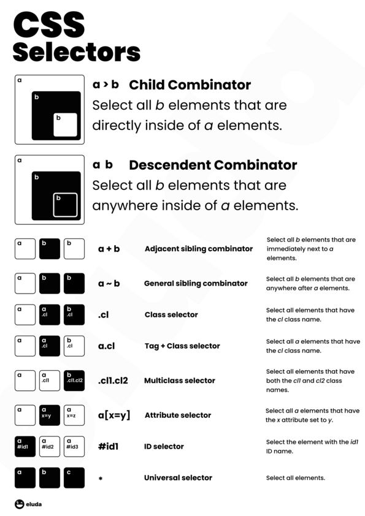](./assets/css_selectors_print.png) |

## :sparkles: CSS Box Model

| Preview                           | Property                                                     | Description                                                  |
| --------------------------------- | ------------------------------------------------------------ | ------------------------------------------------------------ |
| [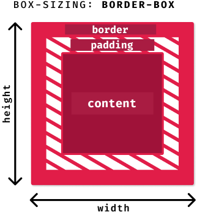](https://developer.mozilla.org/en-US/docs/Learn/CSS/Building_blocks/The_box_model) | 
[`box-sizing: border-box`](https://developer.mozilla.org/en-US/docs/Learn/CSS/Building_blocks/The_box_model)
 | The `width` and `height` have the size of `content`+`padding`+`border` |
|  | 
[`box-sizing: content-box`](https://developer.mozilla.org/en-US/docs/Learn/CSS/Building_blocks/The_box_model)
 | The `width` and `height` have the size of just `content` |

| High Resolution |
| --------------- |
|  |

## :sparkles: CSS Grid Layout

| Align Content                             |
| --------------------------------- |
| 
Distribute content along the horizontal axis.
 |
| <table><tr><td markdown="true">[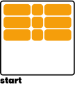](https://developer.mozilla.org/en-US/docs/Web/CSS/align-content)</td><td markdown="true">[`align-content: start`](https://developer.mozilla.org/en-US/docs/Web/CSS/align-content)</td><td markdown="true">[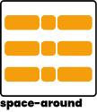](https://developer.mozilla.org/en-US/docs/Web/CSS/align-content)</td><td markdown="true">[`align-content: space-around`](https://developer.mozilla.org/en-US/docs/Web/CSS/align-content)</td></tr><tr><td markdown="true"></td><td markdown="true">[`align-content: center`](https://developer.mozilla.org/en-US/docs/Web/CSS/align-content)</td><td markdown="true"></td><td markdown="true">[`align-content: space-between`](https://developer.mozilla.org/en-US/docs/Web/CSS/align-content)</td></tr><tr><td markdown="true"></td><td markdown="true">[`align-content: end`](https://developer.mozilla.org/en-US/docs/Web/CSS/align-content)</td><td markdown="true"></td><td markdown="true">[`align-content: stretch`](https://developer.mozilla.org/en-US/docs/Web/CSS/align-content)</td></tr></table> |

| Justify Content                             |
| --------------------------------- |
| 
Distribute content along the vertical axis.
 |
| <table><tr><td markdown="true"></td><td markdown="true">[`justify-content: start`](https://developer.mozilla.org/en-US/docs/Web/CSS/justify-content)</td><td markdown="true"></td><td markdown="true">[`justify-content: space-around`](https://developer.mozilla.org/en-US/docs/Web/CSS/justify-content)</td></tr><tr><td markdown="true">[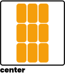](https://developer.mozilla.org/en-US/docs/Web/CSS/justify-content)</td><td markdown="true">[`justify-content: center`](https://developer.mozilla.org/en-US/docs/Web/CSS/justify-content)</td><td markdown="true">[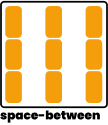](https://developer.mozilla.org/en-US/docs/Web/CSS/justify-content)</td><td markdown="true">[`justify-content: space-between`](https://developer.mozilla.org/en-US/docs/Web/CSS/justify-content)</td></tr><tr><td markdown="true">[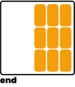](https://developer.mozilla.org/en-US/docs/Web/CSS/justify-content)</td><td markdown="true">[`justify-content: end`](https://developer.mozilla.org/en-US/docs/Web/CSS/justify-content)</td><td markdown="true">[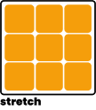](https://developer.mozilla.org/en-US/docs/Web/CSS/justify-content)</td><td markdown="true">[`justify-content: stretch`](https://developer.mozilla.org/en-US/docs/Web/CSS/justify-content)</td></tr></table> |

| Align Items                             |
| --------------------------------- |
| 
Distribute content along the horizontal axis within their grid area.
 |
| <table><tr><td markdown="true"></td><td markdown="true">[`align-items: start`](https://developer.mozilla.org/en-US/docs/Web/CSS/align-items)</td><td markdown="true">[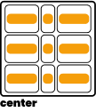](https://developer.mozilla.org/en-US/docs/Web/CSS/align-items)</td><td markdown="true">[`align-items: center`](https://developer.mozilla.org/en-US/docs/Web/CSS/align-items)</td></tr><tr><td markdown="true"></td><td markdown="true">[`align-items: end`](https://developer.mozilla.org/en-US/docs/Web/CSS/align-items)</td><td markdown="true"></td><td markdown="true">[`align-items: stretch`](https://developer.mozilla.org/en-US/docs/Web/CSS/align-items)</td></tr></table> |

| Justify Items                            |
| --------------------------------- |
| 
Distribute content along the vertical axis within their grid area.
 |
| <table><tr><td markdown="true"></td><td markdown="true">[`justify-items: start`](https://developer.mozilla.org/en-US/docs/Web/CSS/justify-items)</td><td markdown="true">[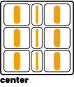](https://developer.mozilla.org/en-US/docs/Web/CSS/justify-items)</td><td markdown="true">[`justify-items: center`](https://developer.mozilla.org/en-US/docs/Web/CSS/justify-items)</td></tr><tr><td markdown="true"></td><td markdown="true">[`justify-items: end`](https://developer.mozilla.org/en-US/docs/Web/CSS/justify-items)</td><td markdown="true"></td><td markdown="true">[`justify-items: stretch`](https://developer.mozilla.org/en-US/docs/Web/CSS/justify-items)</td></tr></table> |

| High Resolution | Grayscale Print |
| --------------- | --------------- |
| [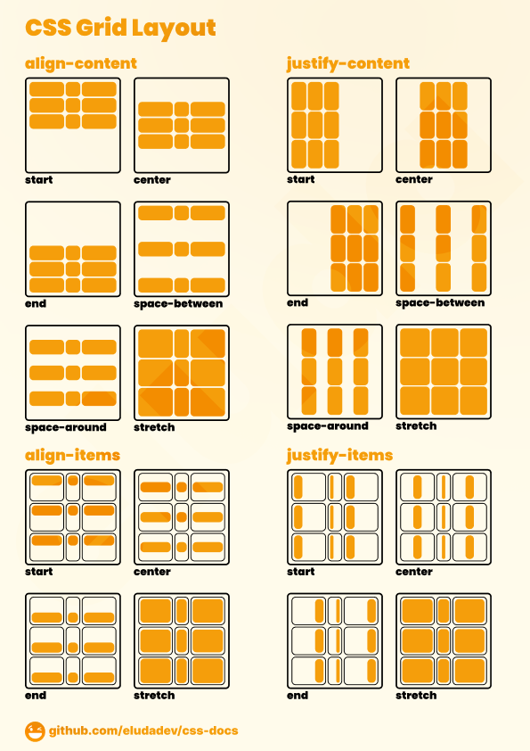](./assets/css_grid.png) | [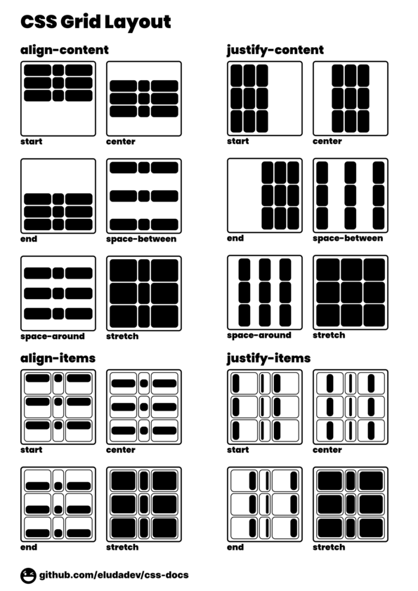](./assets/css_grid_print.png) |

## :sparkles: CSS Flexbox Layout

| Flex Direction                             |
| --------------------------------- |
| 
The flex-direction CSS property sets how flex items are placed in the flex container defining the main axis and the direction (normal or reversed).
 |
| <table><tr><td markdown="true">[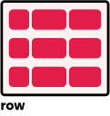](https://developer.mozilla.org/en-US/docs/Web/CSS/flex-direction)</td><td markdown="true">[`flex-direction: row`](https://developer.mozilla.org/en-US/docs/Web/CSS/flex-direction)</td><td markdown="true"></td><td markdown="true">[`flex-direction: column`](https://developer.mozilla.org/en-US/docs/Web/CSS/flex-direction)</td></tr><tr><td markdown="true">[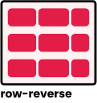](https://developer.mozilla.org/en-US/docs/Web/CSS/flex-direction)</td><td markdown="true">[`flex-direction: row-reverse`](https://developer.mozilla.org/en-US/docs/Web/CSS/flex-direction)</td><td markdown="true">[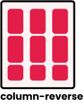](https://developer.mozilla.org/en-US/docs/Web/CSS/flex-direction)</td><td markdown="true">[`flex-direction: column-reverse`](https://developer.mozilla.org/en-US/docs/Web/CSS/flex-direction)</td></tr></table> |

| Align Content                             |
| --------------------------------- |
| 
The CSS align-content property sets the distribution of space between and around content items along a flexbox's cross-axis.
 |
| <table><tr><td markdown="true">[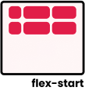](https://developer.mozilla.org/en-US/docs/Web/CSS/align-content)</td><td markdown="true">[`align-content: flex-start`](https://developer.mozilla.org/en-US/docs/Web/CSS/align-content)</td><td markdown="true">[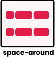](https://developer.mozilla.org/en-US/docs/Web/CSS/align-content)</td><td markdown="true">[`align-content: space-around`](https://developer.mozilla.org/en-US/docs/Web/CSS/align-content)</td></tr><tr><td markdown="true"></td><td markdown="true">[`align-content: center`](https://developer.mozilla.org/en-US/docs/Web/CSS/align-content)</td><td markdown="true">[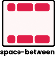](https://developer.mozilla.org/en-US/docs/Web/CSS/align-content)</td><td markdown="true">[`align-content: space-between`](https://developer.mozilla.org/en-US/docs/Web/CSS/align-content)</td></tr><tr><td markdown="true"></td><td markdown="true">[`align-content: flex-end`](https://developer.mozilla.org/en-US/docs/Web/CSS/align-content)</td><td markdown="true"></td><td markdown="true">[`align-content: stretch`](https://developer.mozilla.org/en-US/docs/Web/CSS/align-content)</td></tr></table> |

| Justify Content                             |
| --------------------------------- |
| 
The CSS justify-content property defines how the browser distributes space between and around content items along the main-axis of a flex container.
 |
| <table><tr><td markdown="true"></td><td markdown="true">[`justify-content: flex-start`](https://developer.mozilla.org/en-US/docs/Web/CSS/justify-content)</td><td markdown="true"></td><td markdown="true">[`justify-content: space-around`](https://developer.mozilla.org/en-US/docs/Web/CSS/justify-content)</td></tr><tr><td markdown="true"></td><td markdown="true">[`justify-content: center`](https://developer.mozilla.org/en-US/docs/Web/CSS/justify-content)</td><td markdown="true">[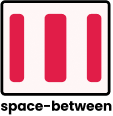](https://developer.mozilla.org/en-US/docs/Web/CSS/justify-content)</td><td markdown="true">[`justify-content: space-between`](https://developer.mozilla.org/en-US/docs/Web/CSS/justify-content)</td></tr><tr><td markdown="true"></td><td markdown="true">[`justify-content: flex-end`](https://developer.mozilla.org/en-US/docs/Web/CSS/justify-content)</td><td markdown="true"></td><td markdown="true">[`justify-content: stretch`](https://developer.mozilla.org/en-US/docs/Web/CSS/justify-content)</td></tr></table> |

| Align Items                             |
| --------------------------------- |
| 
The CSS align-items property sets the align-self value on all direct children as a group. In Flexbox, it controls the alignment of items on the Cross Axis.
 |
| <table><tr><td markdown="true"></td><td markdown="true">[`align-items: flex-start`](https://developer.mozilla.org/en-US/docs/Web/CSS/align-items)</td><td markdown="true"></td><td markdown="true">[`align-items: center`](https://developer.mozilla.org/en-US/docs/Web/CSS/align-items)</td></tr><tr><td markdown="true"></td><td markdown="true">[`align-items: flex-end`](https://developer.mozilla.org/en-US/docs/Web/CSS/align-items)</td><td markdown="true"></td><td markdown="true">[`align-items: stretch`](https://developer.mozilla.org/en-US/docs/Web/CSS/align-items)</td></tr></table> |

| High Resolution | Grayscale Print |
| --------------- | --------------- |
| [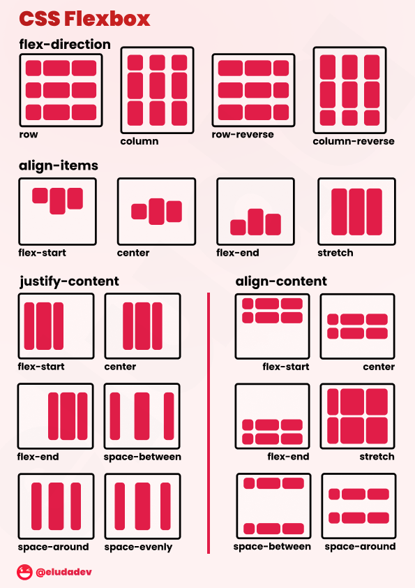](./assets/css_flexbox.png) | [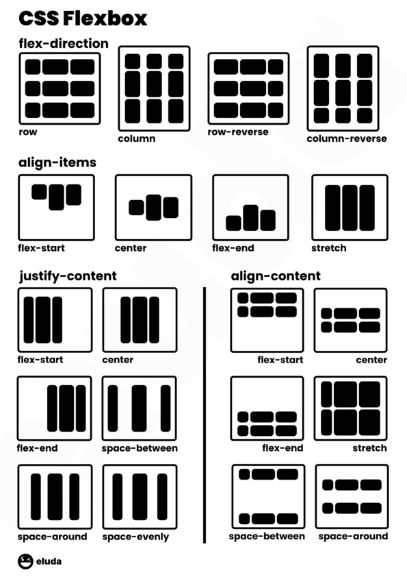](./assets/css_flexbox_print.png) |