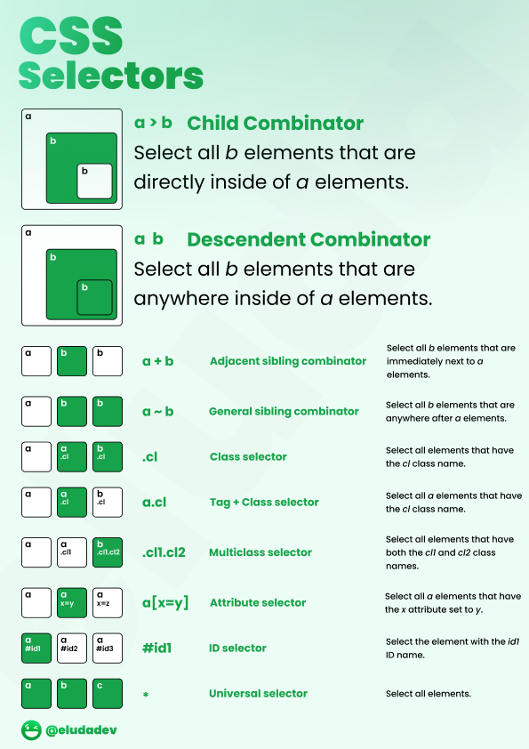
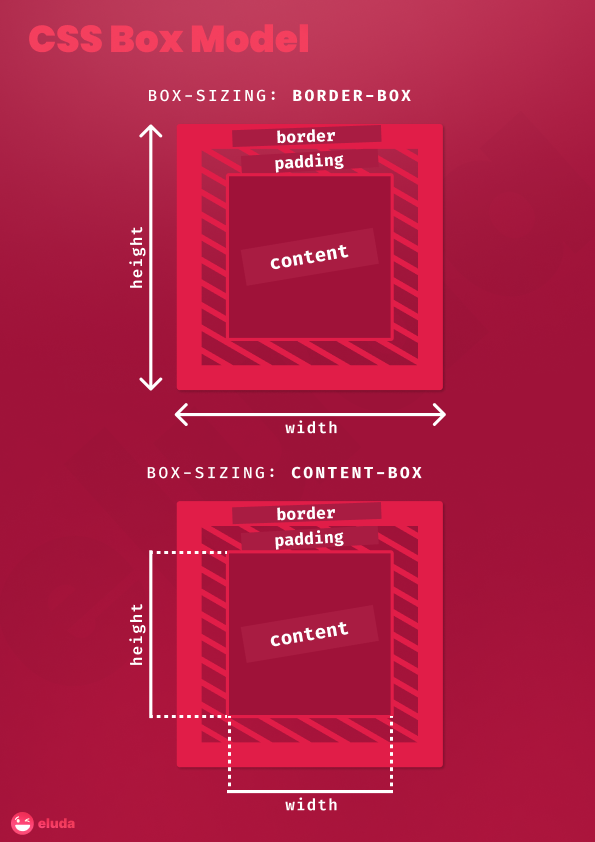
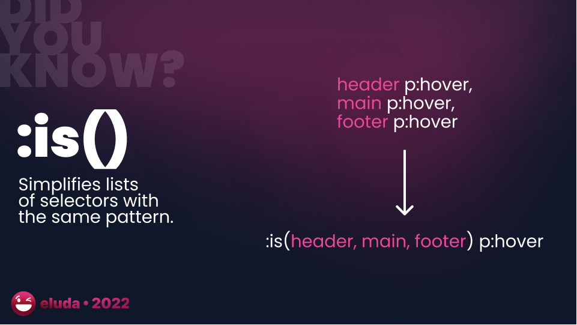
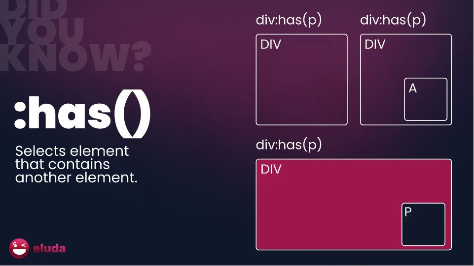

## :paperclip: CSS Cheatsheets

| Preview                                                      | Reference                                                    | Description                                                  |
| ------------------------------------------------------------ | ------------------------------------------------------------ | ------------------------------------------------------------ |
|  | [MDN CSS Selectors](https://developer.mozilla.org/en-US/docs/Web/CSS/CSS_Selectors) | CSS Child Combinator, Descendant Combinator, Adjacent Sibling Combinator, General Sibling Combinator, Class Selector, Attribute Selector, Universal Selector. |
|  | [MDN Box Model](https://developer.mozilla.org/en-US/docs/Learn/CSS/Building_blocks/The_box_model) | `box-sizing: content-box` sets width to the size of the content (not including padding and border), whereas `box-sizing: border-box` sets the width to the size of the content + padding + border. |

## :red_circle: New CSS Features

| Preview                                                      | Reference                                                    | Description                                          |
| ------------------------------------------------------------ | ------------------------------------------------------------ | ---------------------------------------------------- |
|  | [MDN :is() Selector](https://developer.mozilla.org/en-US/docs/Web/CSS/:is) | Simplifies lists of selectors with the same pattern. |
|  | [MDN :has() Selector](https://developer.mozilla.org/en-US/docs/Web/CSS/:has) | Selects element that contains another element.       |

